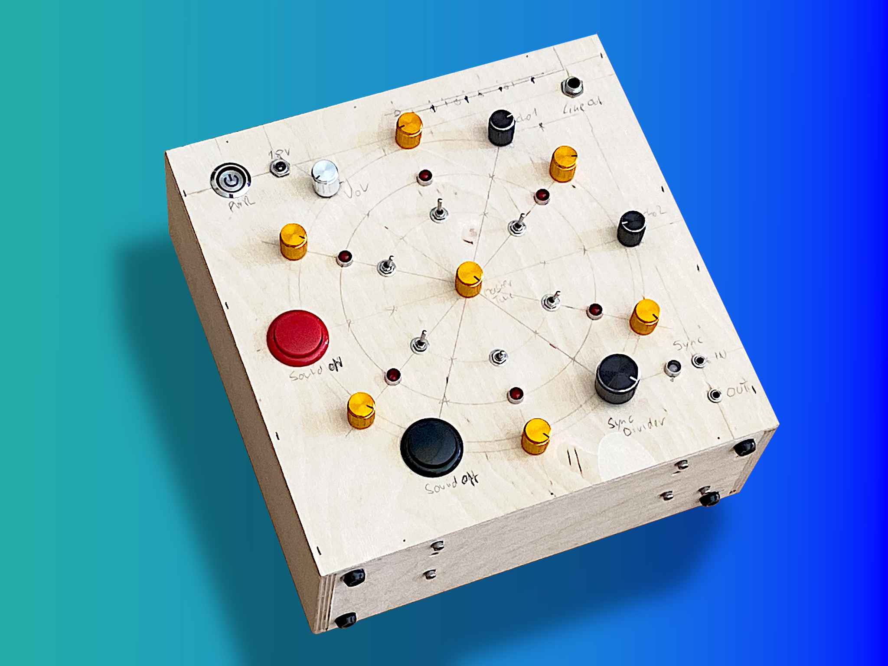
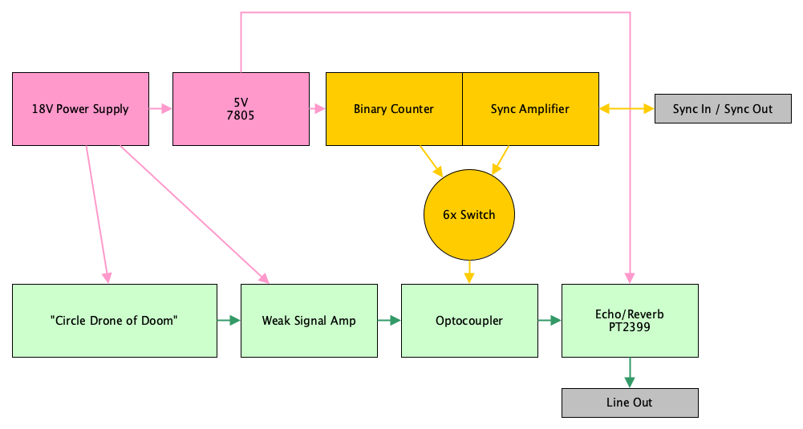
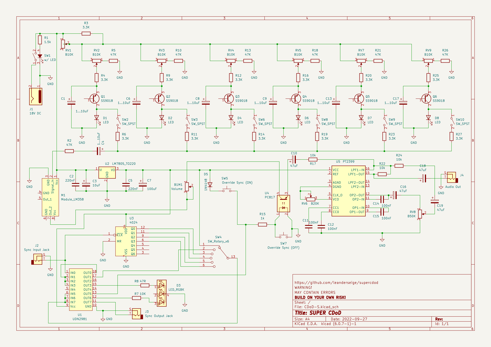
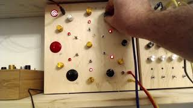

# SUPER Circle Drone of Doom

This is the documentation of my 2nd DIY synthesizer.

This project is based on the circuit diagram of the [Circle Drone of Doom](https://www.lookmumnocomputer.com/projects#/circledroneofdoom) by LOOK MUM NO COMPUTER. This circuit has six fascinating simple oscillators and I added a few more features to it.

The machine now provides:
- six oscillators and one additional detune knob
- an PT2399 based echo/reverb unit
- an always-on and an always-off button
- an input jack for external sync pulses (Sync24 aka DIN_Sync)
- a sync output jack (simply repeating the input signal)
- a frequency divider
- a 6-step rotary switch with the options
  - always on
  - input pulses
  - input x2 (holding high level)
  - input x4 (holding high level)
  - input x8 (holding high level)
  - input x16 (holding high level)

## Inspiration Sources

I thank LOOK MUM NO COMPUTER and Peter Vis for providing inspiring things on the net:

- The [Circle Drone of Doom](https://www.lookmumnocomputer.com/projects#/circledroneofdoom)

- Echo circuit, using PT2399: https://www.petervis.com/guitar-circuits/pt2399/testing-and-troubleshooting.html

## One Premanufactured Module

I used a cheap premanufactured LM358 signal amplifier module. I stumbled across it's existence while researching for another project (https://www.hackster.io/mircemk/diy-sensitive-arduino-ib-metal-detector-d5e029). This module seems to be sold by many sellers. I bought this one: https://www.amazon.de/gp/product/B08216TP3D

## Circuit Diagram

Overview

**WARNING!** This circuit diagram may contain errors! Build only on your own risk! Please think and be sceptical when building this circuit.

Notes:
* The diode D5 may seem useless here, actually I should have put it between the output of the UDN2981 and the optocoupler.
* C1/6/8/9/13/17: choose between 1 and 10 uF according to the description of the original Circle Drone of Doom.

## Videos

